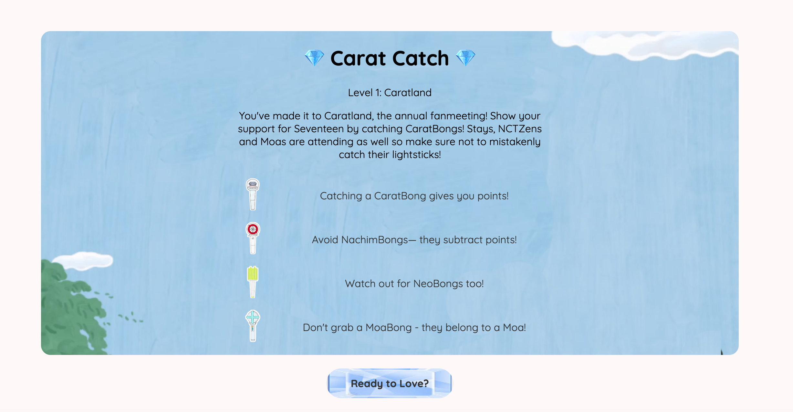
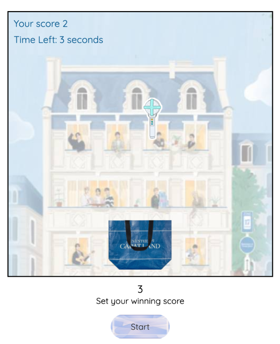
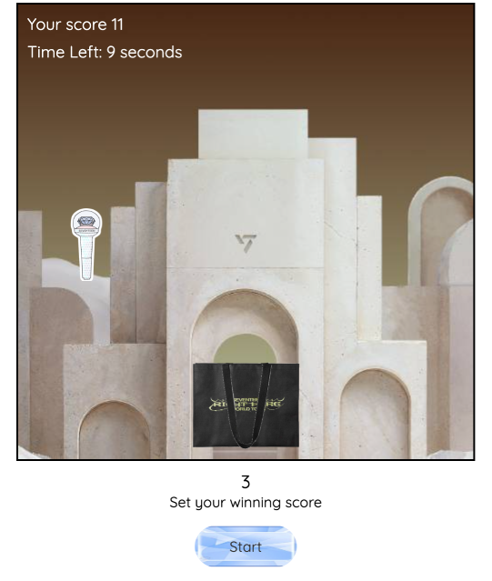
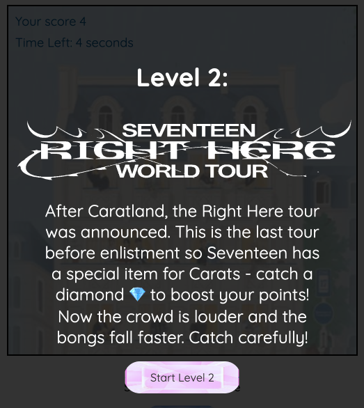
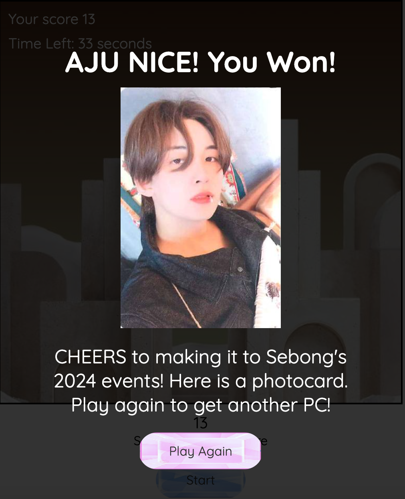
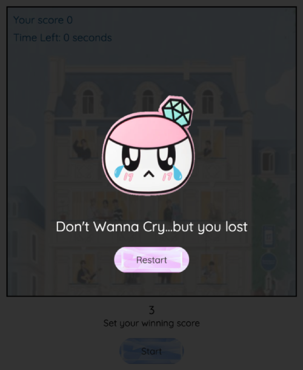

# 💎Carat Catch💎

## Inspiration 🩷🩵
Fans are not merely concert goers, with hearts full of devotion and minds brimming with creativity, they continuously discover new and meaningful ways to uplift their idols as well as each other within the fan community. 

From full scale fan support projects (food booths, banners handed out to concert attendees) and self made merchandise, snack packs and artwork, the spirit of fandom knows no bounds.

As "secondary" fan of the Kpop boy group Seventeen who is acquainted with a few too many Carats, their energy and spirit have inspired me to contribute to the community in my own way. With my new skills acquired, I've set out to build a little something Carats can enjoy. 

## Gameplay 🎮

A game made for fans of the Kpop boyband Seventeen, where users catch earn points by catching Seventeen's lightsticks known as "Caratbong" and lose points when they catch the lightsticks of other groups. 

A second level is made more complex with items falling at a faster speed and a special item which boosts the user's points. 

When the user wins both levels, they are awarded a digital photocard of a random member. 

Game imagery is centered around Seventeen's two major events in 2024 - their fanmeeting Caratland (in level 1) and their subsequent Right Here tour (in level 2)

## Screenshots

### Intro Screen

### Play view

### Level 1 Win View

### Level 2 Win View

### Lose View

## Technologies Used
- HTML
- CSS
- JavaScript

## Links 🔗

- [Live Game](https://jamienahx.github.io/Carat-Catch-Game/)
- [Presentation](https://www.canva.com/design/DAGmXI1WS7g/3DAWgJolnsYJ1aNJw8xO8A/edit)

## Acknowledgements
- [Caratbong image]('https://www.pinterest.com/pin/seventeen-carat-bong-2-sticker-for-sale-by-chesera--767160117782148129/')
- [Neobong image]('https://www.pinterest.com/pin/lightstick-stickers-for-sale--593067844680102497/')
- [Moabong image]('https://ro.pinterest.com/pin/834362268499997917/')
- [Caratland Tote Image]('https://krmerchs.com/products/seventeen-2024-carat-land-shopper-bag')
- [Seventeen Right Here Tote Image]('https://krmerchs.com/products/seventeen-right-here-world-tour-shopper-bag)
- [Caratland promo image 1]('https://campaigns.weverse.io/WV47AEWA9?theme=light&lang=EN')
- [Caratland promo image 2 (screenshot from videoseventeen )]('https://weverse.io/seventeen/media/2-145198228')
- [Seventeen Right Here promo image]('https://en.wikipedia.org/wiki/Right_Here_World_Tour')

## Roadmap
- Add more levels with varying items, complexity
- Imagery of members 

